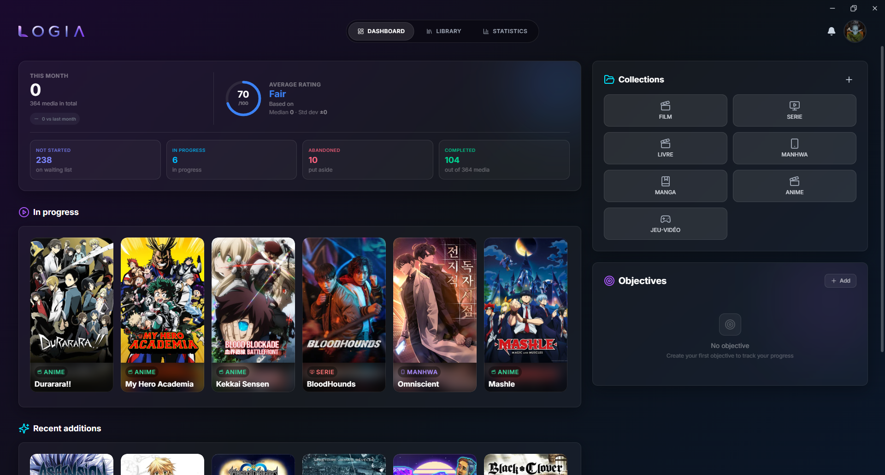
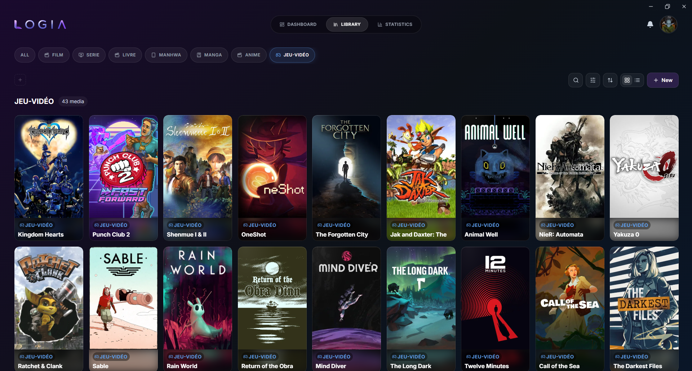
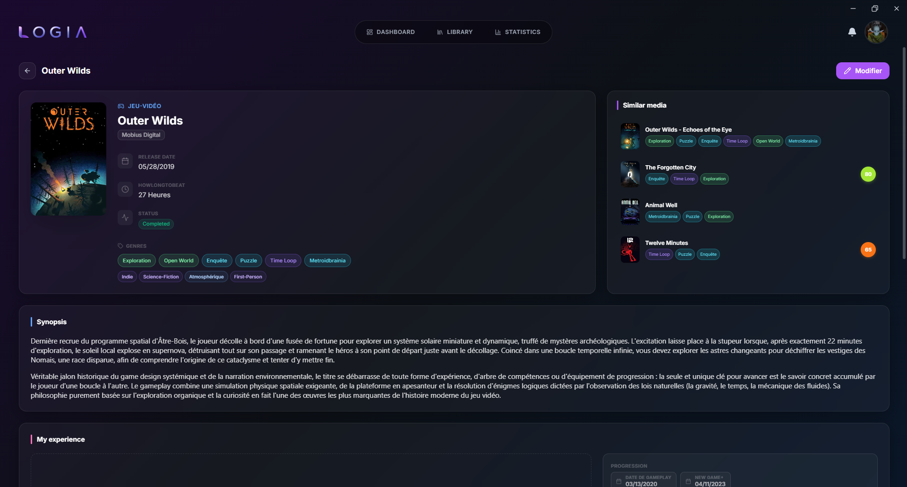
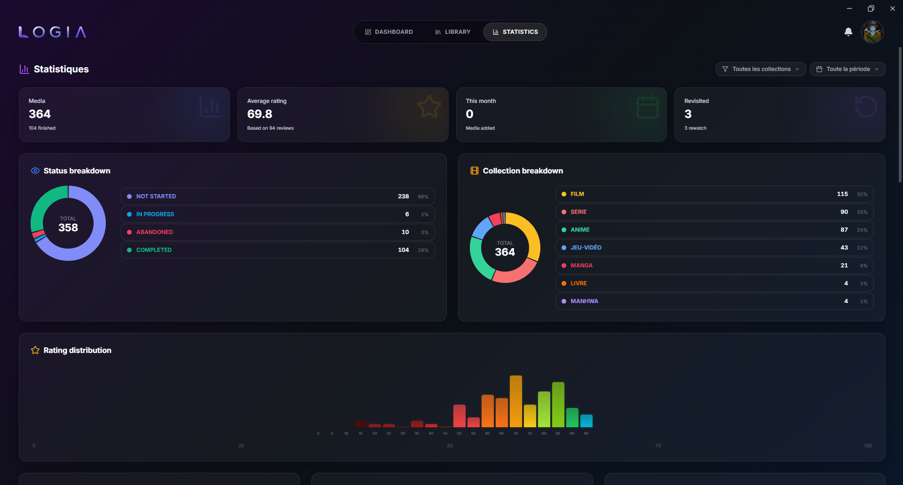

<div align="center">


# Logia

**Track your media progression and organize your collections.**  
Catalog and manage your movies, series, anime, manga, and video games — 100% offline.

[](LICENSE)
[](https://github.com/Cosmiir/logia/releases)
[](#installation)
[](https://buymeacoffee.com/cosmiir)



</div>

---

## About

Logia is a **100% offline** desktop application for tracking your progression across all your media. No account, no cloud, no external API — your data stays on your machine, in a local SQLite database.

Built for people who consume varied media (movies, series, anime, manga, video games) and want a single place to track, rate, and analyze everything.

---

## Features

### 📚 Dynamic Collections
- Create unlimited collections with custom names, icons, and colors
- Each collection has configurable labels (creator, date, progression unit, etc.)
- Fully user-driven — no predefined collections, you build your own library from scratch
- 100% manual entry — no dependency on any external API

### 📊 Dual Status System
- **Progress status**: Not Started, In Progress, On Hold, Completed, Abandoned
- **Media status**: Upcoming, Ongoing, Hiatus, Completed, Cancelled, Abandoned
- Track both independently for granular organization

### 🔍 Search & Filters
- Full-text search (FTS5) across title, creator, and synopsis/review
- Advanced filtering by status, collection, rating, and date
- Multi-criteria sorting
- Two view modes: grid and list

### ✍️ Detailed Media Cards
- Synopsis and review written with a Markdown editor ([Gravity UI](https://gravity-ui.com/))
- Customizable progression tracking (chapters, episodes, hours, percent, etc.)
- Genre tagging system
- 100-point rating scale
- Similar media detection based on shared genres

### � Statistics
- Breakdown by status and collection
- Rating distribution
- Per-collection averages
- Best and worst rated media
- Filters by collection and time period

### 🎨 Personalization
- 5 themes: Nebula, Midnight, Ember, Forest, Arctic
- 4 card densities: Compact, Normal, Large, Detailed
- Window button styles: Windows, macOS, Hybrid
- Toggleable interface animations
- Available in **English** and **French**

### 💾 Data Export
- Text export: **Markdown**, **CSV**, **TSV**
- ZIP backup:
  - Profile only (collections, settings)
  - Full profile (including media images)

### ⚙️ Other
- Multiple profiles with independent databases per profile
- Per-profile password protection
- Keyboard shortcuts
- Integrated notification system
- Configurable storage directory

---

## Screenshots

| Dashboard | Library |
|-----------|---------|
|  |  |

| Media Detail | Statistics |
|--------------|------------|
|  |  |

| Personalization | Settings |
|-----------------|----------|
|  |  |

---

## Installation

### Direct download (recommended)

Visit the [**Releases**](https://github.com/Cosmiir/logia/releases) page and download the installer for your platform:

| Platform | File |
|----------|------|
| Windows | `Logia_x.x.x_x64-setup.exe` (NSIS) or `Logia_x.x.x_x64_en-US.msi` |
| macOS | *(untested — Tauri supports macOS)* |
| Linux | *(untested — Tauri supports Linux)* |

### From source

**Prerequisites:**
- [Node.js](https://nodejs.org/) (v18+)
- [Rust](https://www.rust-lang.org/tools/install) + [Tauri CLI](https://tauri.app/start/prerequisites/)

```bash
# Clone the repo
git clone https://github.com/Cosmiir/logia.git
cd logia

# Install dependencies
npm install

# Run in development
npm run tauri dev

# Build for production
npm run tauri build
```

---

## Tech Stack

| Layer | Technology |
|-------|------------|
| Frontend | React 19 + TypeScript + TailwindCSS 4 |
| Backend | Tauri 2.10 (Rust) |
| Database | SQLite (WAL + FTS5) |
| State | Zustand 5 + TanStack Query 5 |
| Animations | Framer Motion 11 |

---

## License

Distributed under the **MIT** License. See [`LICENSE`](LICENSE) for details.

```
Copyright (c) 2026 Cosmiir
```

---

## Support

Logia is free and open source. If you find the project useful and want to support its development:

[](https://buymeacoffee.com/cosmiir)

---

<div align="center">
  <sub>Built with passion — Open Source ❤️</sub>
</div>