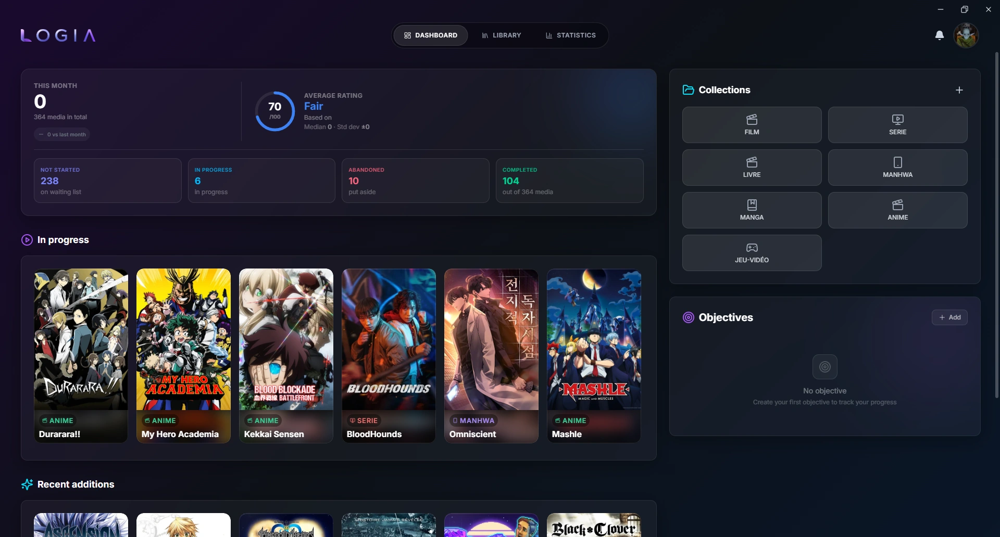
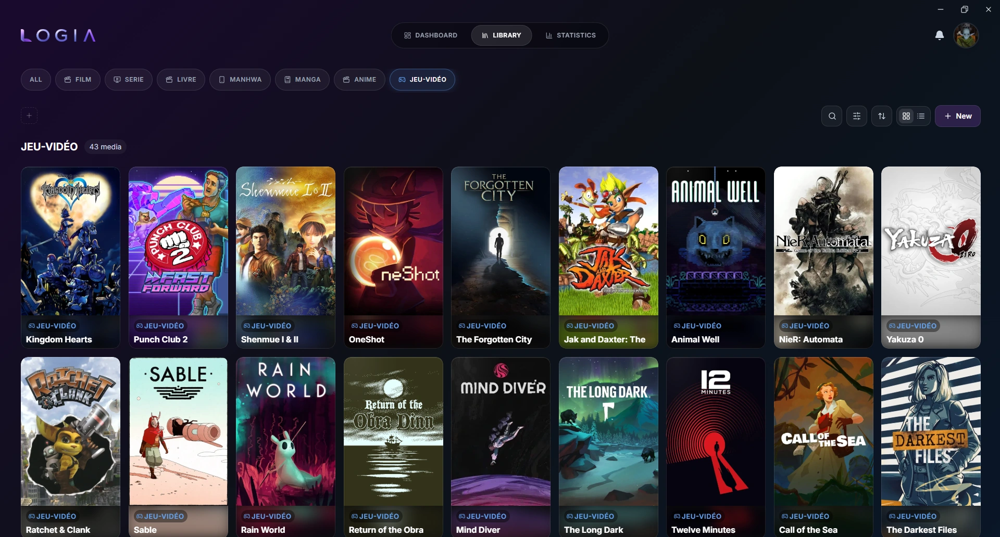
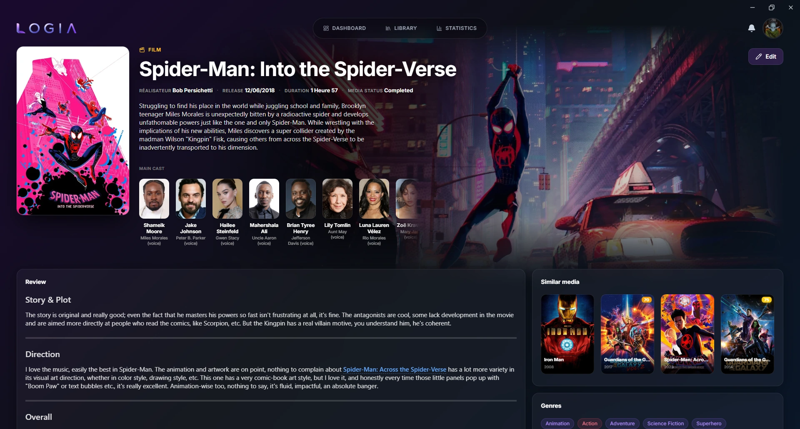
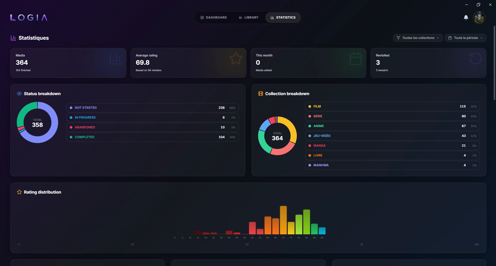
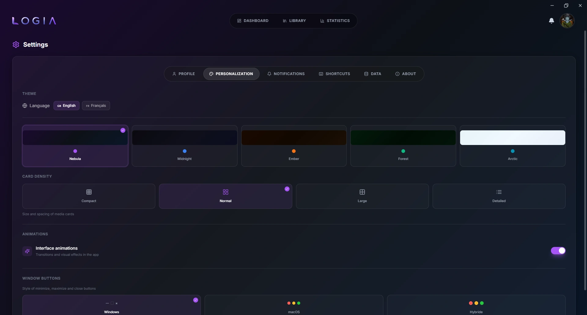
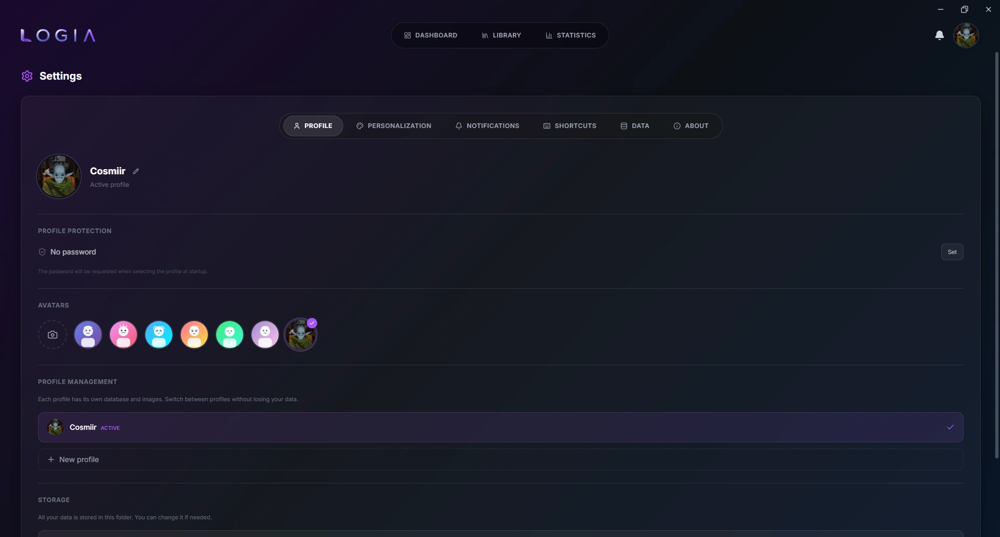

<div align="center">


**Track everything you love.**  
Catalog and manage your movies, series, anime, manga, games, books, music, and custom collections. Offline by default, with optional API enrichment.

[](LICENSE)
[](https://github.com/Cosmiir/logia/releases)
[](#installation)
[](https://ko-fi.com/cosmiir)



</div>

## About

Logia is an **offline-first** desktop application designed to track and organize everything you love. It starts as a clean, blank canvas with zero predefined categories, allowing you to build custom collections tailored exactly to your needs: movies, video games, board games, theater, music, or even personal travel logs and restaurants.

API enrichment is entirely optional: you can enable it per-collection to automatically pre-fill media details (title, creator, date, synopsis, images) from external sources like TMDB, AniList, IGDB, MusicBrainz, and more. API keys (when required) are stored locally and never leave your machine.

Public details are automated, but your personal experience remains strictly under your control: ratings, notes, reviews, progression, and logged dates are yours to fill or leave empty. Everything is saved in a local SQLite database on your machine.

## Features

###  Dynamic Collections
- **Blank Canvas:** No pre-set clutter. Start from scratch and create only the collections you actually need
- **Adaptive Field Labels:** Tailor dynamic fields to match each collection type (e.g., rename *Creator* to *Director* for movies, or *Progression* to *Hours* or *Pages*)
- **Track Anything:** Perfect for movies, series, anime, books, video games, board games, theater, music, or personal logs like restaurants and trips
- **100% Offline Core:** Powered by a local SQLite database with zero cloud dependencies
- **Optional API Enrichment:** Map collections to external providers (TMDB, Jikan, AniList, TVMaze, MusicBrainz, iTunes, RAWG, IGDB, OMDb) to auto-fill media details on creation

###  Dual Status System
- **Progress status**: Not Started, In Progress, On Hold, Completed, Abandoned
- **Media status**: Upcoming, Ongoing, Hiatus, Completed, Cancelled, Abandoned
- Track both independently for granular organization

###  Search & Filters
- Full-text search (FTS5) across title, creator, and synopsis/review
- Advanced filtering by status, collection, rating, and date
- Multi-criteria sorting
- Two view modes: grid and list

###  Detailed Media View
- Synopsis and review written with a Markdown editor ([Gravity UI](https://gravity-ui.com/))
- Customizable progression tracking (chapters, episodes, hours, percent, etc.)
- **Experience entries**: track multiple experiences per media with date, version (e.g. Director's Cut, 1.0), and language (with flag indicators)
- Genre tagging system
- 100-point rating scale
- Similar media detection based on shared genres

###  Statistics
- Breakdown by status and collection
- Rating distribution
- Per-collection averages
- Best and worst rated media
- Filters by collection and time period

###  Personalization
- 5 themes: Nebula, Midnight, Ember, Forest, Arctic
- 4 card densities: Compact, Normal, Large, Detailed
- Window button styles: Windows, macOS, Hybrid
- Toggleable interface animations
- Available in **English** and **French**

###  Data Export & Import
- Text export: **Markdown**, **CSV**, **TSV**
  - Configurable columns, delimiter, and rating scale
  - Filter by collection or export all
- ZIP backup (3 levels):
  - Database only (collections, settings)
  - Database + media images
  - Full backup (database + images + attachments)
- ZIP import: overwrite or merge with skip-duplicates option
- CSV import: column mapping, status mapping, auto-create collections and genres, configurable rating scale
- Profile merge: import data from another profile with skip-duplicates option

###  Other
- Multiple profiles with independent databases per profile
- Per-profile password protection
- Keyboard shortcuts
- Integrated notification system
- Configurable storage directory

## Screenshots

| Dashboard | Library |
|-----------|---------|
|  |  |

| Media Detail | Statistics |
|--------------|------------|
|  |  |

| Personalization | Settings |
|-----------------|----------|
|  |  |

## Installation

### Direct download (recommended)

Visit the [**Releases**](https://github.com/Cosmiir/logia/releases) page and download the installer for your platform:

| Platform | File |
|----------|------|
| Windows | `Logia_x.x.x_x64-setup.exe` (NSIS) or `Logia_x.x.x_x64_en-US.msi` |
| macOS | `Logia_x.x.x_universal.dmg` (Intel + Apple Silicon). Not code-signed: right-click → Open on first launch, or `xattr -dr com.apple.quarantine /Applications/Logia.app` |
| Linux | `Logia_x.x.x_amd64.AppImage` (recommended, supports auto-updates), `.deb`, or `.rpm` |
| | *Note: only the AppImage supports in-app auto-updates; `.deb`/`.rpm` require manual updates.* |

### From source

**Prerequisites:**
- [Node.js](https://nodejs.org/) (v20.19+)
- [Rust](https://www.rust-lang.org/tools/install) + [Tauri CLI](https://tauri.app/start/prerequisites/)

```bash
# Clone the repo
git clone https://github.com/Cosmiir/logia.git
cd Logia

# Install dependencies
npm install

# Run in development
npm run tauri dev

# Build for production
npm run tauri build
```

## Tech Stack

| Layer | Technology |
|-------|------------|
| Frontend | React 19 + TypeScript + TailwindCSS 4 |
| Backend | Tauri 2.10 (Rust) |
| Database | SQLite (WAL + FTS5) |
| State | Zustand 5 + TanStack Query 5 |
| Animations | Framer Motion 11 |

## License

Distributed under the **MIT** License. See [`LICENSE`](LICENSE) for details.

```
Copyright (c) 2026 Cosmiir
```

## Support

Logia is free and open source, built and maintained in my spare time. If it's useful to you, a coffee helps keep it going:

[](https://ko-fi.com/cosmiir)

<div align="center">
  <sub>Built with passion — Open Source ❤️</sub>
</div>